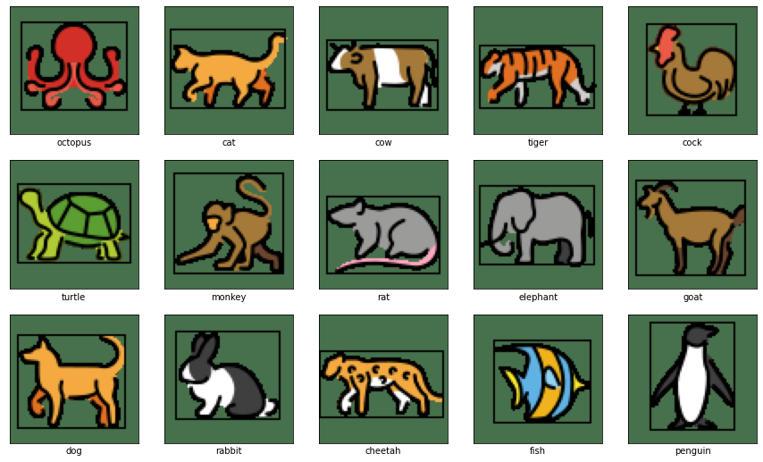
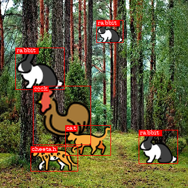
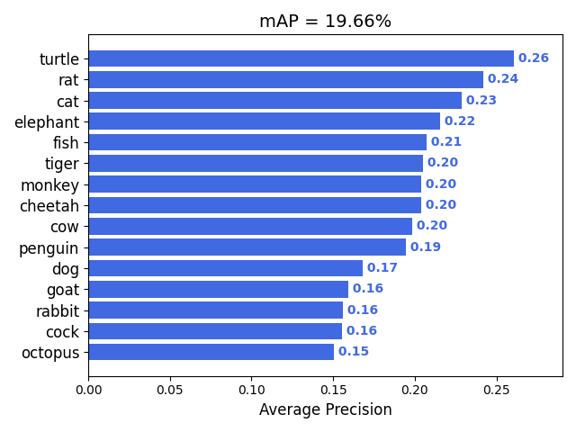

# custom One - Stage Object Detector from scratch

One stage object detectors are the perfect ones which predicts with high accuracy as well as high speed.
The most famous One Stage detectors are SSD and YOLO family. 
A comparision between slight differences which they have and their overall working is explained here:  https://machinethink.net/blog/object-detection. I would highly recommend beginners as well as experienced ones to freshen up their concepts before proceeding with the <a href="full_object_detection_code.ipynb">Notebook</a>

The model is builts using Tensorflow and Keras

## Classes
The model classifies 16 different categories which includes 15 animals shown below and 1 background class

## Architecture
The model architecture is a rather simple one but works good enough to begin with.

### Model Summary

    Model: "model_1"
    __________________________________________________________________________________________________
     Layer (type)                   Output Shape         Param #     Connected to                     
    ==================================================================================================
     image (InputLayer)             [(None, 320, 320, 3  0           []                               
                                    )]                                                                

     conv2d_1 (Conv2D)              (None, 320, 320, 16  448         ['image[0][0]']                  
                                    )                                                                 

     maxpool2d_1 (MaxPooling2D)     (None, 160, 160, 16  0           ['conv2d_1[0][0]']               
                                    )                                                                 

     batchnorm_1 (BatchNormalizatio  (None, 160, 160, 16  64         ['maxpool2d_1[0][0]']            
     n)                             )                                                                 

     conv2d_2 (Conv2D)              (None, 160, 160, 32  4640        ['batchnorm_1[0][0]']            
                                    )                                                                 

     maxpool2d_2 (MaxPooling2D)     (None, 80, 80, 32)   0           ['conv2d_2[0][0]']               

     batchnorm_2 (BatchNormalizatio  (None, 80, 80, 32)  128         ['maxpool2d_2[0][0]']            
     n)                                                                                               

     conv2d_3 (Conv2D)              (None, 80, 80, 64)   18496       ['batchnorm_2[0][0]']            

     maxpool2d_3 (MaxPooling2D)     (None, 40, 40, 64)   0           ['conv2d_3[0][0]']               

     batchnorm_3 (BatchNormalizatio  (None, 40, 40, 64)  256         ['maxpool2d_3[0][0]']            
     n)                                                                                               

     conv2d_4 (Conv2D)              (None, 40, 40, 128)  73856       ['batchnorm_3[0][0]']            

     maxpool2d_4 (MaxPooling2D)     (None, 20, 20, 128)  0           ['conv2d_4[0][0]']               

     batchnorm_4 (BatchNormalizatio  (None, 20, 20, 128)  512        ['maxpool2d_4[0][0]']            
     n)                                                                                               

     conv2d_5 (Conv2D)              (None, 20, 20, 256)  295168      ['batchnorm_4[0][0]']            

     maxpool2d_5 (MaxPooling2D)     (None, 10, 10, 256)  0           ['conv2d_5[0][0]']               

     batchnorm_5 (BatchNormalizatio  (None, 10, 10, 256)  1024       ['maxpool2d_5[0][0]']            
     n)                                                                                               

     conv2d_6 (Conv2D)              (None, 10, 10, 256)  590080      ['batchnorm_5[0][0]']            

     maxpool2d_6 (MaxPooling2D)     (None, 5, 5, 256)    0           ['conv2d_6[0][0]']               

     batchnorm_6 (BatchNormalizatio  (None, 5, 5, 256)   1024        ['maxpool2d_6[0][0]']            
     n)                                                                                               

     conv2d_7 (Conv2D)              (None, 3, 3, 256)    590080      ['batchnorm_6[0][0]']            

     conv2d_8 (Conv2D)              (None, 1, 1, 512)    1180160     ['conv2d_7[0][0]']               

     box_20x20 (Conv2D)             (None, 20, 20, 16)   18448       ['maxpool2d_4[0][0]']            

     box_10x10 (Conv2D)             (None, 10, 10, 16)   36880       ['maxpool2d_5[0][0]']            

     box_5x5 (Conv2D)               (None, 5, 5, 16)     36880       ['maxpool2d_6[0][0]']            

     box_3x3 (Conv2D)               (None, 3, 3, 16)     36880       ['conv2d_7[0][0]']               

     box_1x1 (Conv2D)               (None, 1, 1, 16)     73744       ['conv2d_8[0][0]']               

     class_20x20 (Conv2D)           (None, 20, 20, 64)   73792       ['maxpool2d_4[0][0]']            

     class_10x10 (Conv2D)           (None, 10, 10, 64)   147520      ['maxpool2d_5[0][0]']            

     class_5x5 (Conv2D)             (None, 5, 5, 64)     147520      ['maxpool2d_6[0][0]']            

     class_3x3 (Conv2D)             (None, 3, 3, 64)     147520      ['conv2d_7[0][0]']               

     class_1x1 (Conv2D)             (None, 1, 1, 64)     294976      ['conv2d_8[0][0]']               

     box_20x20_reshape (Reshape)    (None, 1600, 4)      0           ['box_20x20[0][0]']              

     box_10x10_reshape (Reshape)    (None, 400, 4)       0           ['box_10x10[0][0]']              

     box_5x5_reshape (Reshape)      (None, 100, 4)       0           ['box_5x5[0][0]']                

     box_3x3_reshape (Reshape)      (None, 36, 4)        0           ['box_3x3[0][0]']                

     box_1x1_reshape (Reshape)      (None, 4, 4)         0           ['box_1x1[0][0]']                

     class_20x20_reshape (Reshape)  (None, 1600, 16)     0           ['class_20x20[0][0]']            

     class_10x10_reshape (Reshape)  (None, 400, 16)      0           ['class_10x10[0][0]']            

     class_5x5_reshape (Reshape)    (None, 100, 16)      0           ['class_5x5[0][0]']              

     class_3x3_reshape (Reshape)    (None, 36, 16)       0           ['class_3x3[0][0]']              

     class_1x1_reshape (Reshape)    (None, 4, 16)        0           ['class_1x1[0][0]']              

     box_out (Concatenate)          (None, 2140, 4)      0           ['box_20x20_reshape[0][0]',      
                                                                      'box_10x10_reshape[0][0]',      
                                                                      'box_5x5_reshape[0][0]',        
                                                                      'box_3x3_reshape[0][0]',        
                                                                      'box_1x1_reshape[0][0]']        

     class_out (Concatenate)        (None, 2140, 16)     0           ['class_20x20_reshape[0][0]',    
                                                                      'class_10x10_reshape[0][0]',    
                                                                      'class_5x5_reshape[0][0]',      
                                                                      'class_3x3_reshape[0][0]',      
                                                                      'class_1x1_reshape[0][0]']      

     final_output (Concatenate)     (None, 2140, 20)     0           ['box_out[0][0]',                
                                                                      'class_out[0][0]']              

    ==================================================================================================
    Total params: 3,770,096
    Trainable params: 3,768,592
    Non-trainable params: 1,504
    __________________________________________________________________________________________________

## Input and Output
Input is an Image of shape 320 x 320 x 3 for inferencing,
along with 4 sets of one hot encoded class and 4 sets of bounding boxes per image in case of training (4 is the the value I used it can be more or less doesnt matters)

### SAMPLE INPUT

### SAMPLE OUTPUT

## Performance

For model performance evaluation I used this repo: https://github.com/Cartucho/mAP
which calculates the model mAP. I calculated mAP@0.5 and here are the results:

The results doesn't looks good enough but it was result of the simple model with just 3.7M trainable parameters trained for 100 epochs at 100 iterations each.
Remember this repo is not about creating the best model (that may come later), but it's to give you the starting point to test your own Architecture for Object Detection. I learnt many things building it and I am sure you will too.

## Usage

Goto the <a href="full_object_detection_code.ipynb">Notebook</a>, I have tried to document it as good as I can.
Open the notebook in colab and click on Runtime->Run all and watch a new model being trained from scratch.

## What Next?

If you really want to understand that how exactly Single Stage Object Detection works or how Object Detection works in general, spend some time with this Notebook, and also try your own Architecture and find out how well that works. 

1. There is Data Generator in place 
2. There is Anchor Generator in place 
3. There are Losses and Metrices in place 
4. There is Inference and Visualization in place 
5. There is Model Evaluation in place 

Now all you need is to dig deep into it and create your own Object Detection Architecture.

Some tips to improve performance of model are:

1. Introduce more layers i.e. deepen the architecture
2. Introduce Dropout Layers
3. Introduce skip connections, depth wise convulations etc.
4. Do some reserach on your own.

That's all folks hope you learn something from it. Please leave a star if it helped in anyway. 
THANKS
